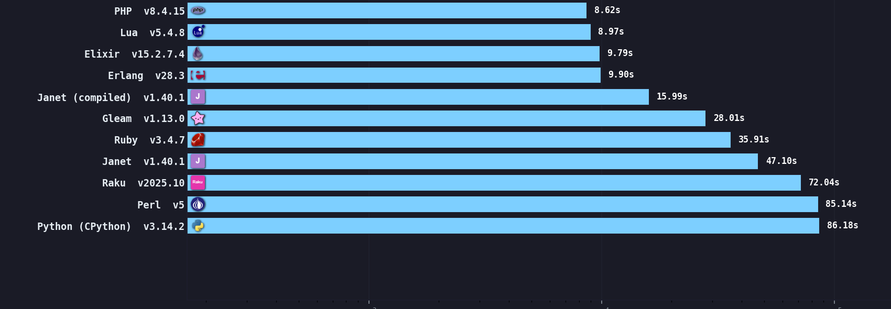
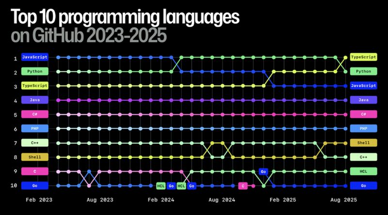

<!-- _class: title -->
<!-- _paginate: false -->


<div class="cover-divider"></div>

# Introdução ao Python

<div class="subtitle">
<a href="https://github.com/laurogripa/python-udesc">https://github.com/laurogripa/python-udesc</a>
</div>

<div class="author">
<strong>Lauro Gripa Neto</strong><br>
Prof. Dr. Marcelo da Silva Hounsell<br>
Computação Gráfica Avançada<br>
Mestrado em Computação Aplicada<br>
15/06/2026
</div>

---

<!-- _class: content -->

## Sobre mim

<div class="compact">

- Graduado em **Tecnologia em Análise e Desenvolvimento de Sistemas** pela Universidade do Estado de Santa Catarina, em 2016.
- Começou a programar por hobby aos **13 anos**, com mIRC Script.
- Iniciou profissionalmente aos **22 anos**, com PHP e JavaScript.
- **2,5 anos** no desenvolvimento de ERPs.
- **5 anos** em consultoria e *outsourcing* especializado, trabalhando com diversas linguagens.
- Experiência principalmente com **Ruby on Rails**.
- Breve experiência profissional com **Python**, em 2019.
- Nos últimos **5 anos**, atua como freelancer em Web3/Blockchain com TypeScript, React e Rust.
- Especializou-se em **Web, Desenvolvimento Ágil e Sistemas Descentralizados (Blockchain)**.

</div>

---

<!-- _class: content -->

## Sumário

- História
- Filosofia
- Características
- Vantagens
- Limitações
- Usos comuns
- Exemplos
- Exercícios

---

<!-- _class: content -->

## Avisos importantes

- **30 minutos de mentoria** para cada equipe.
- Todas as equipes terão o mesmo direito.
- Basta marcar um horário pelo [https://calendly.com/lauro-gripa/30min](https://calendly.com/lauro-gripa/30min).
- Confirmação por e-mail.

---

<!-- _class: history -->

## História do Python

- Criado por **Guido van Rossum**; primeira versão pública em **20 de fevereiro de 1991**.
- Nome inspirado no grupo de comédia **Monty Python**.

<div class="portrait">

<div class="portrait-caption"><strong>Guido van Rossum</strong><br>“Benevolent dictator for life” (1995–2018)</div>
</div>

---

<!-- _class: content -->

## Motivações

- Desenvolver uma linguagem **acessível**, com sintaxe clara e adequada ao trabalho cotidiano.
- Manter a **simplicidade e legibilidade** da linguagem ABC.
- Superar a dificuldade de **extensão e integração** da ABC.
- Automatizar tarefas no sistema operacional distribuído **Amoeba**.
- Oferecer uma alternativa mais prática que **C** para scripts.
- Permitir integração fácil com módulos e bibliotecas escritos em **C**.

---

<!-- _class: zen -->

## Filosofia da linguagem: o Zen do Python

<table class="zen-table">
<tr><td>Bonito é melhor que feio.</td><td>Erros nunca devem passar silenciosamente.</td></tr>
<tr><td>Explícito é melhor que implícito.</td><td>A menos que sejam explicitamente silenciados.</td></tr>
<tr><td>Simples é melhor que complexo.</td><td>Diante da ambiguidade, recuse a tentação de adivinhar.</td></tr>
<tr><td>Complexo é melhor que complicado.</td><td>Deve haver uma maneira óbvia de fazer algo.</td></tr>
<tr><td>Plano é melhor que aninhado.</td><td>Mesmo que ela não seja óbvia à primeira vista.</td></tr>
<tr><td>Esparso é melhor que denso.</td><td>Agora é melhor que nunca.</td></tr>
<tr><td>Legibilidade conta.</td><td>Nunca pode ser melhor que agora mesmo.</td></tr>
<tr><td>Casos especiais não quebram as regras.</td><td>Se é difícil explicar, a ideia é ruim.</td></tr>
<tr><td>A praticidade vence a pureza.</td><td>Se é fácil explicar, pode ser uma boa ideia.</td></tr>
<tr><td></td><td><em>Namespaces</em> são uma ótima ideia: vamos usá-los mais!</td></tr>
</table>

---

<!-- _class: content -->

## Principais características

- Execução **interpretada**, normalmente a partir de bytecode.
- Suporte a múltiplos **paradigmas de programação**.
- Blocos de código definidos por **indentação significativa**.
- Tipagem **dinâmica e forte**.
- **Gerenciamento automático de memória**.
- Ampla biblioteca padrão e ecossistema **extensível**.

---

<!-- _class: table-slide -->

## Python é multiparadigma

<table class="classic-table">
<tr><th>Paradigma</th><th>Na prática</th></tr>
<tr><td>Programação imperativa</td><td>Instruções alteram o estado do programa passo a passo.</td></tr>
<tr><td>Programação procedural</td><td>Scripts organizam tarefas em funções reutilizáveis.</td></tr>
<tr><td>Programação orientada a objetos</td><td>Aplicações maiores usam classes e objetos.</td></tr>
<tr><td>Programação funcional</td><td>Funções como <code>map()</code> e <code>filter()</code> transformam dados.</td></tr>
</table>

<div class="note">Os paradigmas podem coexistir no mesmo projeto.</div>

---

<!-- _class: table-slide -->

## Compilado vs. interpretado

<table class="classic-table comparison-table">
<tr><th>Critério</th><th>Compilado</th><th>Interpretado</th></tr>
<tr><td>Tradução</td><td>Antes da execução</td><td>Durante a execução, com auxílio do interpretador</td></tr>
<tr><td>Resultado</td><td>Código de máquina ou outra representação</td><td>Execução mediada por outro programa</td></tr>
<tr><td>Característica</td><td>Geralmente oferece maior desempenho</td><td>Favorece portabilidade e experimentação</td></tr>
<tr><td>Exemplo típico</td><td><strong>C</strong></td><td><strong>Python com CPython</strong></td></tr>
</table>

<div class="note">

A distinção depende da implementação: uma linguagem pode combinar compilação e interpretação.

</div>

---

<!-- _class: content -->

## Linguagem interpretada

<div class="compact">

- O código-fonte é executado com a ajuda de um **interpretador**.
- Em CPython, o código é transformado em **bytecode** antes da execução.
- O bytecode pode ser armazenado em arquivos `.pyc`.
- **CPython** é a implementação principal e mais utilizada da linguagem.
- A execução difere de linguagens compiladas diretamente para código de máquina, como C.

</div>

<div class="note">

Java também usa uma representação intermediária; JavaScript normalmente é executado por mecanismos com interpretação e compilação JIT.

</div>

---

<!-- _class: table-slide -->

## Tipagem dinâmica e forte

<table class="classic-table comparison-table">
<tr><th>Critério</th><th>Dinâmica</th><th>Forte</th></tr>
<tr><td>Associação do tipo</td><td>O tipo está associado ao <strong>valor</strong>, não à variável</td><td>Os valores preservam seus tipos durante as operações</td></tr>
<tr><td>Flexibilidade</td><td>Uma variável pode receber valores de tipos diferentes</td><td>Conversões incompatíveis não são realizadas implicitamente</td></tr>
<tr><td>Consequência</td><td>Menos declarações são necessárias no código inicial</td><td>Operações entre tipos inadequados geram erro</td></tr>
<tr><td>Conversões</td><td>O tipo é determinado durante a execução</td><td>Conversões devem ser feitas de forma explícita</td></tr>
</table>

<div class="note">

Python possui tipagem <strong>dinâmica e forte</strong>. Também utiliza <em>duck typing</em>: o que importa é o comportamento oferecido pelo objeto, e não seu tipo declarado.

</div>

---

<!-- _class: content -->

## Tipagem: vantagens e riscos

<div class="compact columns">

<div>

### Vantagens

- Menos código inicial
- Maior flexibilidade
- Experimentação rápida
- APIs simples de usar

</div>

<div>

### Problemas comuns

- Erros descobertos em execução
- Manutenção mais difícil em projetos grandes
- Refatorações mais arriscadas
- Contratos pouco claros entre funções

</div>

</div>

<div class="note">

**Type hints** documentam os tipos esperados e permitem análise estática, sem remover a tipagem dinâmica da linguagem.

</div>

---

<!-- _class: full-image -->

## Desempenho



<div class="source">Fonte: <a href="https://niklas-heer.github.io/speed-comparison/">https://niklas-heer.github.io/speed-comparison/</a></div>

---

<!-- _class: content -->

## Desempenho e limitações

<div class="compact">

- O interpretador adiciona custo à execução.
- A tipagem dinâmica exige verificações em tempo de execução.
- Em CPython, o **Global Interpreter Lock (GIL)** limita a execução simultânea de bytecode por múltiplas threads.
- Python pode ser mais lento que linguagens compiladas em tarefas intensivas de CPU.
- Em automação, integração e prototipagem, o tempo de desenvolvimento costuma ser mais importante.

</div>

---

<!-- _class: content -->

## Estratégias de desempenho

<div class="compact columns">

<div>

### Bibliotecas otimizadas

- NumPy
- Pandas
- OpenCV
- Implementações nativas em C/C++

</div>

<div>

### Outras alternativas

- PyPy
- Cython
- `multiprocessing`
- Partes críticas em C, C++ ou Rust

</div>

</div>

<div class="note">

Primeiro identifique o gargalo; depois escolha a estratégia adequada.

</div>

---

<!-- _class: content -->

## Por que Python é bom para prototipagem?

<div class="compact">

- Sintaxe simples e legível
- Pouco código para produzir resultados úteis
- Facilidade para testar ideias rapidamente
- REPL e notebooks para experimentação
- Grande quantidade de bibliotecas
- Boa curva de aprendizado
- Aplicação em scripts, automações e MVPs

</div>

---

<!-- _class: code-comparison -->

## Hello, World!: Python vs. C

<div class="columns">

<div>

### Python

```python
print("Hello, World!")
```

</div>

<div>

### C

```c
#include <stdio.h>

int main(void) {
    printf("Hello, World!\n");
    return 0;
}
```

</div>

</div>

---

<!-- _class: code-comparison -->

## Indentação e sintaxe

<div class="columns">

<div>

- A indentação define os blocos de código.
- Os dois-pontos (`:`) iniciam um novo bloco.
- Não são necessárias chaves para delimitar o escopo.
- O padrão recomendado é usar quatro espaços por nível.

</div>

<div>

```python
idade = 18

if idade >= 18:
    print("Maior de idade")
else:
    print("Menor de idade")
```

</div>

</div>

---

<!-- _class: content -->

## Usos comuns de Python

<div class="compact columns">

<div>

- Ciência de dados
- Inteligência artificial e *machine learning*
- Automação de tarefas
- Desenvolvimento web
- APIs e backends

</div>

<div>

- Educação e ensino de programação
- Jogos simples e protótipos
- Testes e ferramentas internas
- Segurança e redes
- DevOps

</div>

</div>

---

<!-- _class: full-image -->

## Popularidade



---

<!-- _class: content -->

## Sintaxe básica

<div class="compact columns">

<div>

### Estrutura

- Indentação obrigatória
- Comentários com `#`
- Blocos sem chaves
- Código organizado em arquivos `.py`

</div>

<div>

### Variáveis e tipos

- `int`
- `float`
- `str`
- `bool`
- Operadores aritméticos e lógicos

</div>

</div>

---

<!-- _class: content -->

## Entrada, saída e conversão

<div class="compact">

- `print()` exibe valores na saída padrão.
- `input()` lê uma linha digitada pelo usuário.
- O resultado de `input()` é sempre uma string.
- Funções como `int()`, `float()` e `str()` convertem valores.

</div>

<div class="note">

Entradas inválidas precisam ser tratadas para evitar erros em tempo de execução.

</div>

---

<!-- _class: content -->

## Estruturas condicionais

<div class="compact columns">

<div>

### Decisão

- `if`
- `elif`
- `else`

</div>

<div>

### Expressões

- Operadores relacionais
- `and`, `or` e `not`
- Valores verdadeiros e falsos
- Condições combinadas

</div>

</div>

---

<!-- _class: content -->

## Estruturas de repetição

<div class="compact columns">

<div>

### `while`

- Repete enquanto uma condição for verdadeira.
- Útil quando a quantidade de repetições não é conhecida.
- Exige cuidado com loops infinitos.

</div>

<div>

### `for`

- Percorre itens de uma sequência.
- `range()` produz sequências numéricas.
- `break` interrompe o loop.
- `continue` avança para a próxima repetição.

</div>

</div>

---

<!-- _class: content -->

## Coleções

<div class="compact columns">

<div>

- **Listas:** ordenadas e mutáveis
- **Tuplas:** ordenadas e imutáveis
- **Dicionários:** pares de chave e valor
- **Conjuntos:** valores únicos sem ordem garantida

</div>

<div>

- Strings também são sequências.
- Indexação acessa uma posição.
- *Slicing* seleciona partes de uma sequência.
- Loops permitem percorrer todos os elementos.

</div>

</div>

---

<!-- _class: content -->

## Funções

<div class="compact">

- Funções são definidas com `def`.
- Parâmetros recebem dados de entrada.
- `return` devolve um resultado.
- Variáveis criadas dentro da função possuem escopo local.
- Funções reduzem repetição e organizam responsabilidades.

</div>

<div class="note">

Uma boa função realiza uma tarefa clara e possui entradas e saídas compreensíveis.

</div>

---

<!-- _class: content -->

## Módulos e importações

<div class="compact columns">

<div>

### Reutilização

- `import` carrega módulos.
- A biblioteca padrão oferece recursos prontos.
- Pacotes agrupam módulos relacionados.

</div>

<div>

### Organização

- Separar responsabilidades em arquivos
- Evitar arquivos excessivamente grandes
- Reutilizar funções e classes
- Tornar dependências explícitas

</div>

</div>

---

<!-- _class: content -->

## Tratamento de erros

<div class="compact">

- `try` envolve uma operação que pode falhar.
- `except` trata uma exceção esperada.
- Mensagens claras ajudam o usuário a corrigir a entrada.
- Exceções específicas evitam esconder erros inesperados.

</div>

<div class="note">

Erros comuns de iniciantes incluem indentação incorreta, nomes inexistentes, conversões inválidas e acesso a índices fora da coleção.

</div>

---

<!-- _class: content -->

## Demonstração com Pygame

<div class="compact">

- Criar uma janela
- Entender a estrutura básica de um jogo
- Processar eventos
- Atualizar o estado
- Desenhar na tela
- Repetir essas etapas no loop principal

</div>

---

<!-- _class: content -->

## Estrutura do loop principal

<div class="compact columns">

<div>

### Entrada e atualização

- Capturar teclado
- Processar eventos
- Mover um objeto
- Detectar colisão simples

</div>

<div>

### Desenho e controle

- Limpar a tela
- Desenhar formas
- Atualizar a janela
- Controlar FPS
- Encerrar corretamente

</div>

</div>

---

<!-- _class: content -->

## Recapitulação

<div class="compact">

- Python é uma linguagem acessível, produtiva e multiparadigma.
- A tipagem dinâmica acelera o desenvolvimento, mas exige disciplina.
- O ecossistema torna Python útil em diversas áreas.
- A linguagem é uma boa escolha para automação, ensino e prototipagem.
- Restrições de desempenho podem exigir bibliotecas ou tecnologias complementares.

</div>

---

<!-- _class: content -->

## Próximos passos

<div class="compact columns">

<div>

### Estudo

- Praticar sintaxe e coleções
- Criar funções pequenas
- Organizar código em módulos
- Aprender a ler mensagens de erro

</div>

<div>

### Desafio com Pygame

- Mover um objeto com o teclado
- Impedir que ele saia da janela
- Adicionar um obstáculo
- Detectar e indicar uma colisão

</div>

</div>

---

<!-- _class: references -->

## Referências

- PYTHON SOFTWARE FOUNDATION. **The Python Language Reference**. Python 3.14.6 Documentation, 2026. Disponível em: <https://docs.python.org/3/reference/>. Acesso em: 15 jun. 2026.
- LEARNPYTHON.ORG. **Learn Python: Free Interactive Python Tutorial**. [s.d.]. Disponível em: <https://www.learnpython.org/>. Acesso em: 15 jun. 2026.
- FREE SOFTWARE FOUNDATION. **GNU C Language Manual**. [s.d.]. Disponível em: <https://www.gnu.org/software/c-intro-and-ref/manual/html_node/index.html>. Acesso em: 15 jun. 2026.
- STACK OVERFLOW. **2025 Developer Survey: Technology**. 2025. Disponível em: <https://survey.stackoverflow.co/2025/technology>. Acesso em: 15 jun. 2026.
- HEER, N. **Speed comparison of programming languages**. GitHub, [s.d.]. Disponível em: <https://github.com/niklas-heer/speed-comparison>. Acesso em: 15 jun. 2026.
- HARRIS, C. R. et al. Array programming with NumPy. **Nature**, v. 585, p. 357–362, 2020. DOI: <https://doi.org/10.1038/s41586-020-2649-2>.
